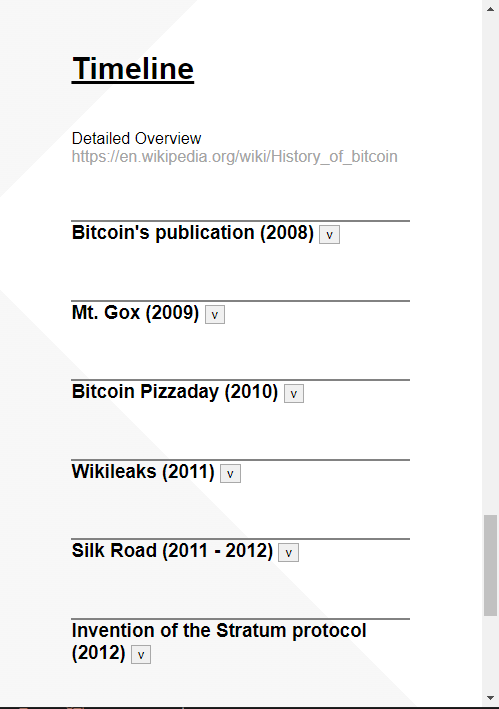

# Bitcoin Overview

## Disclamer 
### Bitcoinoverview.org is currently not hosted
I had some issues setting up the DNS etc.. Help is appriciated.
### The Website isn't finished yet
The website has still many basic construction sites. Empty containers or notes that need more attention.
And with the growth of content around Bitcoin it probably will never be "finished"
### FOSS
This website is entirly free open source software. However the backgroundpictures are from [Freepik](https://www.freepik.com/). They need to be credited.

If you want to you can add content to the original Website [BitcoinOverview.org](https://BitcoinOverview.org) or host your own fork of it.

---

---

## Adding content to BitcoinOverview.org
### Open a pull-request or Issue
Make a pull-request or Issue where you explain what changes you would make.
### Contact a Maintainer
In case you struggle with Github or only want add something small you can contact a Maintaier via social media.
### Goals
* Having a Website were unexpirienced and expirienced users are able to find everything the want to know about Bitcoin.
* Providing the source information. No self created content.
### Rules
1. BitcoinOverview.org doesn't allow the promotion of Fiat or Shitcoin related content.
* That includes trading.
* Altcoins are shitcoins.
* Informational content is ok, as long as it had an important impact on Bitcoin.
2. BitcoinOverview.org doesn't allow illegal content.
3. BitcoinOverview.org is restricted by the terms of use of the hosting provider.

---

## FAQ
Visit our [Q&A](https://github.com/RealCocoArdo/BitcoinOverview/discussions/categories/q-a) for more informations.
