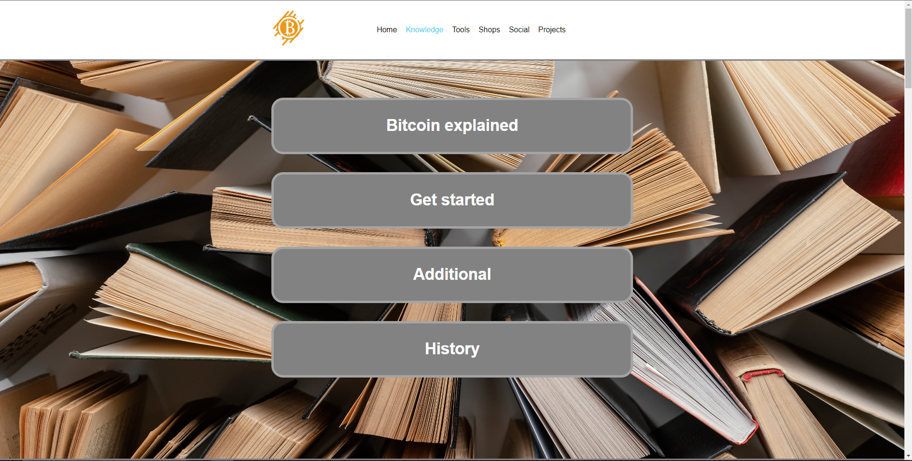
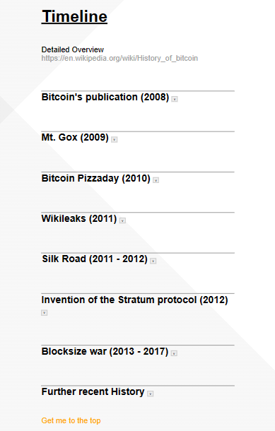
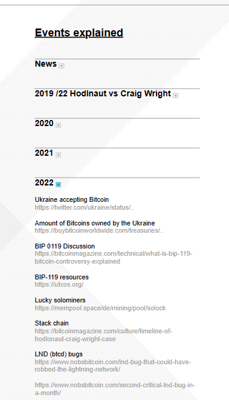

# Bitcoin Overview

---

## Disclamer 
### Bitcoinoverview.org is currently not hosted
I had some issues setting up the DNS etc. Help is appriciated.

However you can visit the [Live-Demo](https://bitcoin-overview.vercel.app/).
### The website isn't finished yet
The website has still many basic construction sites. Empty containers or notes that need more attention.
And with the growth of content around Bitcoin it will never be "finished".
### FOSS
This code has a [MIT License](LICENSE.txt). The backgroundpictures are from [Freepik](https://www.freepik.com/). They need to be credited.

If you want to you can [add](https://github.com/RealCocoArdo/BitcoinOverview#adding-content-to-bitcoinovervieworg) content to the original website [BitcoinOverview.org](https://BitcoinOverview.org) or host your own fork of it.

---

## Review the website offline
1. [Download](https://github.com/RealCocoArdo/BitcoinOverview/archive/refs/heads/main.zip) and save the code.
2. Open the folder were you saved the code.
3. Unzip the downloaded file to a directory of your choice. Ideally in the same folder were you saved the .zip file.
4. Open the folder. Press right click on the "index.html" file and select "Open with" and choose your favourite browser.

## Adding content to BitcoinOverview.org
### Open a pull-request or Issue
Make a [pull-request](https://github.com/RealCocoArdo/BitcoinOverview/pulls) or submit an [issue](https://github.com/RealCocoArdo/BitcoinOverview/issues/new/choose) where you explain what changes you would make. 

You need to be logged in for this.
### Contact a Maintainer
In case you struggle with Github or you just want to add something small you can contact Coco_Ardo via social media.
### Goals
* Having a Website were unexpirienced and expirienced users are able to find **everything** they want to know about Bitcoin. 
* Even if they can't find the informations on BitcoinOverview.org, at least they then know where to find it somewhere else.
* Providing the source information. No self created content.
* Beeing some kind of archiv.
### Rules
1. BitcoinOverview.org doesn't allow the promotion of Fiat or Shitcoin related content.
* That includes trading.
* Altcoins are shitcoins.
* Informational content is ok, as long as it had an important impact on Bitcoin.
2. BitcoinOverview.org doesn't allow illegal content.
3. BitcoinOverview.org is restricted by the terms of use of the hosting provider.

---

## Compatibility
### Browsers
The website should be displayed as intended in most browsers.

| Testet browsers                 | Not yet tested |
|---------------------------------|----------------|
| The onion routing (Tor)         | Safari (Apple) |
| Chromium based (Microsoft Edge) | Ecosia         |
| Mozilla Firefox                 | Brave          |
### Devices
| Typ          | Ratio     | Pixel      | Optimized          |
|--------------|-----------|------------|--------------------|
| Desktop      | 16:9      | 1920x1080  | :heavy_check_mark: |
| Tablet       | inbetween | inbetween  | :x:                |
| Mobile       | 9:16      | >1100x1080 | :heavy_check_mark: |

---

## FAQ
Visit our [Q&A](https://github.com/RealCocoArdo/BitcoinOverview/discussions/categories/q-a) for more informations.

---

## Screenshots

---
