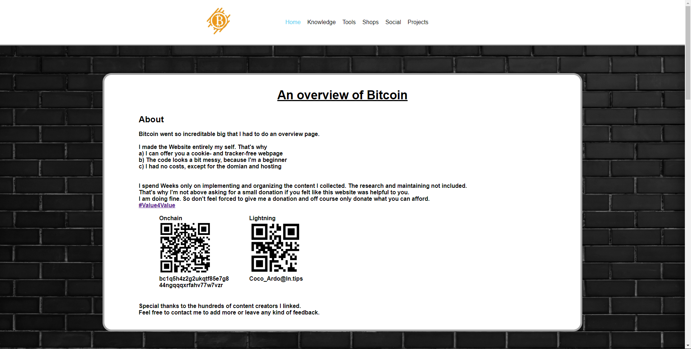
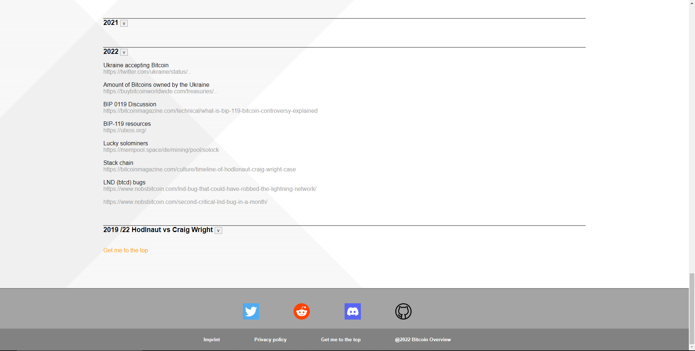

# Bitcoin Overview

## Disclamer Bitcoinoverview.org is currently not hosted
I had some issues setting up the DNS etc.. Help is appriciated. 

---

---

This website is entirly free open source software. However the backgroundpictures are from [Freepik](https://www.freepik.com/). They need to be credited.

If you want to you can add content to the original Website [BitcoinOverview.org](https://BitcoinOverview.org) or host your own fork of it.

---

## Adding content to BitcoinOverview.org
### Open a pull-request or Issue
Make a pull-request or Issue where you explain what changes you would make.
### Contact a Maintainer
In case you struggle with Github or only want add something small you can contact a Maintaier via social media.
### Rules
1. BitcoinOverview.org doesn't allow promotion of Fiat or Shitcoin related content.
* That includes trading.
* Altcoins are shitcoins.
* Informational content is ok, as long as it had an important impact on Bitcoin.
2. BitcoinOverview.org doesn't allow illegal content.
3. BitcoinOverview.org is restricted by the terms of use of the hosting provider.

---

## FAQ
Visit our [Q&A](https://github.com/RealCocoArdo/BitcoinOverview/discussions/categories/q-a) for more informations.
